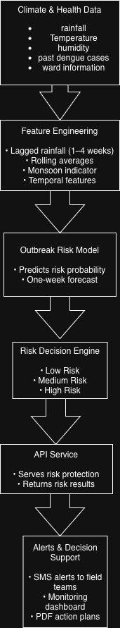

# dengue-early-warning-system
A deployable, explainable AI system for ward-level dengue outbreak risk prediction and 
automated SMS alerts for municipal health teams.
# Dengue Early Warning & SMS Alert System

## Problem Statement

Dengue outbreaks in Indian Tier-2 cities are often detected only after a noticeable
increase in reported cases. By the time intervention begins, mosquito breeding
has already expanded across multiple wards, making containment difficult.

Municipal health departments currently lack a ward-level early warning system
that integrates climate patterns, historical dengue cases, and local population
factors to proactively assess outbreak risk.

As a result, preventive actions such as fogging, source reduction, and field
surveillance are frequently delayed, leading to avoidable disease spread and
inefficient use of public health resources.
## Objective
The objective of this project is to design and deploy a lightweight, explainable
AI-based early warning system that predicts dengue outbreak risk at the ward level
one week in advance.

The system is intended to support municipal health authorities by enabling
proactive, risk-based interventions such as targeted fogging, source reduction,
and intensified field surveillance before outbreaks escalate.
## System Outputs
The system produces the following outputs to support timely and informed
public health decision-making:

- Ward-level dengue outbreak probability for the upcoming week
- Risk classification for each ward: Low, Medium, or High
- Key contributing factors influencing the predicted risk
- Automated alerts for high-risk wards with recommended response actions
## System Overview

The system processes climate, health, and ward-level data to estimate dengue
outbreak risk one week in advance. Predictions are translated into actionable
risk categories and delivered to municipal health teams through automated alerts
and decision-support tools.
## Project Scope
This project focuses on designing an end-to-end dengue early warning system
that emphasizes real-world usability over experimental accuracy.

The scope includes ward-level risk prediction, explainable model outputs,
automated alerting, and decision-support tools for municipal health teams.
The system is designed to be lightweight, deployable, and interpretable.

Out of scope for this project are real-time sensor ingestion, nationwide-scale
deployment, and clinical diagnosis of individual patients.
